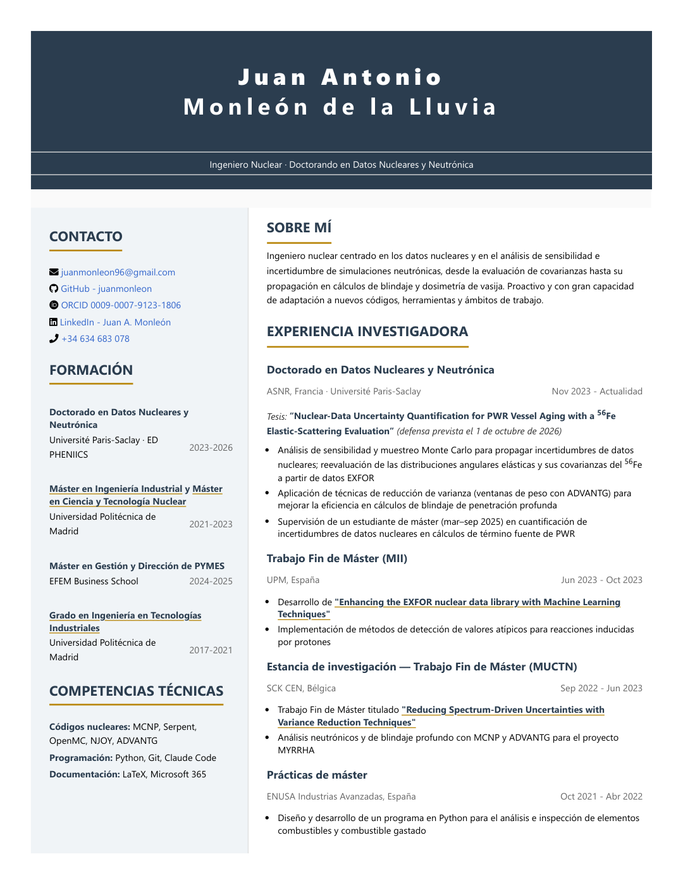
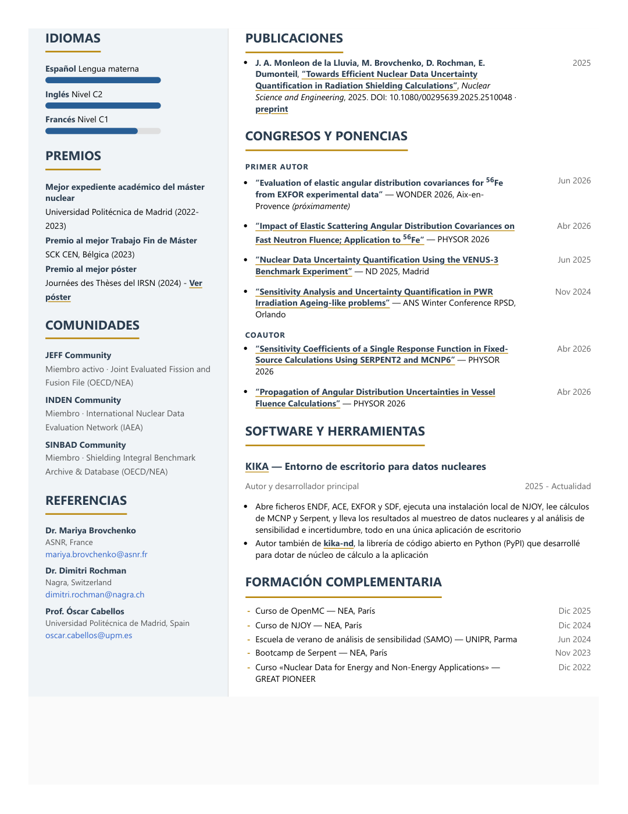

# Juan Antonio Monleón de la Lluvia

**Nuclear Engineer · PhD Candidate in Nuclear Data & Neutronics @ ASNR, France**  
*Thesis: "Nuclear-Data Uncertainty Quantification for PWR Vessel Aging with a ⁵⁶Fe Elastic-Scattering Evaluation" · defence scheduled 1 October 2026*

Working on nuclear data and on the sensitivity and uncertainty analysis of
neutronic simulations, from covariance evaluation to their propagation in
shielding and reactor-dosimetry calculations. Hands-on with MCNP, Serpent,
OpenMC, NJOY and ADVANTG; active member of the JEFF, INDEN and SINBAD
nuclear-data communities.

📄 **[Résumé — PDF (EN)](Resume.pdf)** &nbsp;·&nbsp;
📄 **[Currículum — PDF (ES)](Resume_ES.pdf)** &nbsp;·&nbsp;
🌐 **[View online (EN)](https://juanmonleon.github.io/Resume/)** &nbsp;·&nbsp;
🌐 **[Ver online (ES)](https://juanmonleon.github.io/Resume/index.es.html)** &nbsp;·&nbsp;
💼 **[LinkedIn](https://linkedin.com/in/juanantonio-monleondelalluvia)** &nbsp;·&nbsp;
✉️ **[juanmonleon96@gmail.com](mailto:juanmonleon96@gmail.com)** &nbsp;·&nbsp;
🆔 **[ORCID](https://orcid.org/0009-0007-9123-1806)**

---

  

See page 2

  

Versión en español

  

  

---

## Publications & supporting documents

- **Journal paper (2025)** — [Towards Efficient Nuclear Data Uncertainty Quantification in Radiation Shielding Calculations](files/Monleon_2025_NSE_preprint.pdf) · *Nuclear Science and Engineering* · [DOI](https://www.tandfonline.com/doi/full/10.1080/00295639.2025.2510048)
- **Conference paper (2026)** — [Impact of Elastic Scattering Angular Distribution Covariances on Fast Neutron Fluence; Application to ⁵⁶Fe](files/Monleon_2026_PHYSOR_elastic-covariances.pdf) · PHYSOR 2026
- **Conference paper (2026, co-author)** — [Sensitivity Coefficients of a Single Response Function in Fixed-Source Calculations Using SERPENT2 and MCNP6](files/Monleon_2026_PHYSOR_sensitivity-coefficients.pdf) · PHYSOR 2026
- **Conference paper (2026, co-author)** — [Propagation of Angular Distribution Uncertainties in Vessel Fluence Calculations](files/Monleon_2026_PHYSOR_angular-uncertainties.pdf) · PHYSOR 2026
- **Conference paper (2025)** — [Nuclear Data Uncertainty Quantification Using the VENUS-3 Benchmark Experiment](files/Monleon_2025_ND_conference.pdf) · ND 2025, Madrid
- **Conference paper (2024)** — [Sensitivity Analysis and Uncertainty Quantification in PWR Irradiation Ageing-like problems](files/Monleon_2024_RPSD_conference.pdf) · ANS Winter Conference RPSD, Orlando
- **Award-winning poster (2024)** — [JdT 2024 Poster (IRSN)](files/Monleon_2024_JdT_poster.pdf)
- **Master's thesis (2023)** — [Reducing Spectrum-Driven Uncertainties with Variance Reduction Techniques](files/Monleon_2023_MasterThesis_SCK-CEN.pdf) · SCK CEN, Belgium
- **Master research (2023)** — [Enhancing the EXFOR nuclear data library with Machine Learning Techniques](files/Monleon_2023_MasterResearch_UPM.pdf)
- **KIKA app** — [kika-app.com](https://kika-app.com/) · desktop workspace that opens ENDF, ACE, EXFOR and SDF files, drives a local NJOY installation, reads MCNP and Serpent runs, and carries the results into nuclear-data sampling, sensitivity and uncertainty analysis (built on [kika-nd](https://github.com/juanmonleon/kika), the open-source Python library I wrote to provide its computational core)
- **Degree certificates** — [MII](files/Monleon_Master_MII_UPM.pdf) · [MUCTN](files/Monleon_Master_MUCTN_UPM.pdf) · [GITI](files/Monleon_Bachelor_GITI_UPM.pdf)
