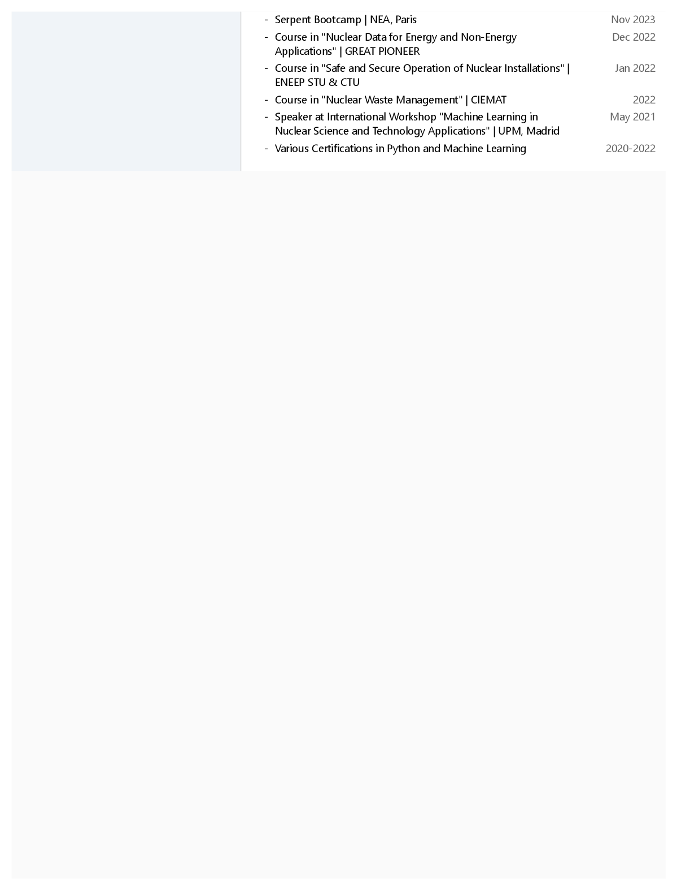

# Juan Antonio Monleón de la Lluvia — Résumé

**Nuclear Engineer · PhD Student in Neutronics @ IRSN, France**

Uncertainty quantification and variance-reduction techniques for reactor-vessel
ageing. Hands-on with MCNP, Serpent, NJOY and ADVANTG, and Python for nuclear
data / machine-learning workflows.

📄 **[Download the résumé (PDF)](Resume.pdf)** &nbsp;·&nbsp;
🌐 **[View the HTML version](https://juanmonleon.github.io/Resume/)** &nbsp;·&nbsp;
💼 **[LinkedIn](https://linkedin.com/in/juanantonio-monleondelalluvia)** &nbsp;·&nbsp;
✉️ **[juanmonleon96@gmail.com](mailto:juanmonleon96@gmail.com)**

---

## Preview

<p align="center">
  <a href="Resume.pdf">
    
  </a>
</p>

<details>
<summary>See pages 2 and 3</summary>

<p align="center">
  
  
</p>

</details>

---

## Repository contents

| Path | What it is |
| --- | --- |
| [`Resume.pdf`](Resume.pdf) | Latest compiled résumé (printable) |
| [`index.html`](index.html) / [`style.css`](style.css) | Source of the résumé — a small static site |
| [`assets/`](assets) | Rendered page previews used above |
| [`files/`](files) | Supporting documents (degree certificates, papers, poster) |

### Supporting documents

- **Conference paper** — [Sensitivity Analysis and Uncertainty Quantification in PWR Irradiation Ageing-like problems](files/2024-11_RPSD_Conference.pdf) · ANS Winter Conference RPSD, Orlando (Nov 2024)
- **Master's thesis** — [Reducing Spectrum-Driven Uncertainties with Variance Reduction Techniques](<files/Reducing Spectrum-Driven Uncertainties with Variance Reduction Techniques.pdf>) · SCK CEN, Belgium
- **Master thesis research** — [Enhancing the EXFOR nuclear data library with Machine Learning Techniques](<files/Enhancing the EXFOR nuclear data library with Machine Learning Techniques.pdf>)
- **Award-winning poster** — [JdT 2024 Poster (IRSN)](files/MONLEON_Poster_JdT24.pdf)
- **Degree certificates** — [MII](files/Titulo_MII.pdf) · [MUCTN](files/Titulo_MUCTN.pdf) · [GITI](files/Titulo_GITI.pdf)

---

## Building the résumé locally

The HTML version is a static page — just open `index.html` in any browser.
To regenerate `Resume.pdf` and the preview images after editing the source:

```bash
# 1. Export PDF from the browser: print index.html → "Save as PDF" → Resume.pdf
# 2. Re-render the page previews used in this README:
gs -sDEVICE=png16m -r150 -dTextAlphaBits=4 -dGraphicsAlphaBits=4 \
   -o assets/resume_page_%d.png Resume.pdf
```
