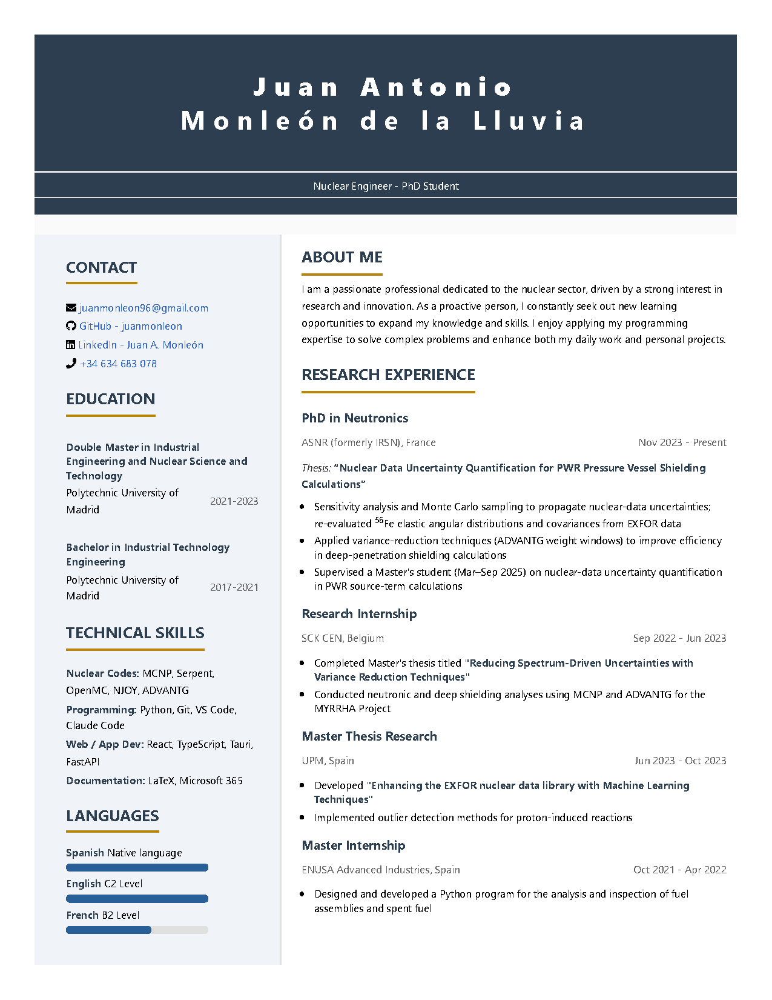
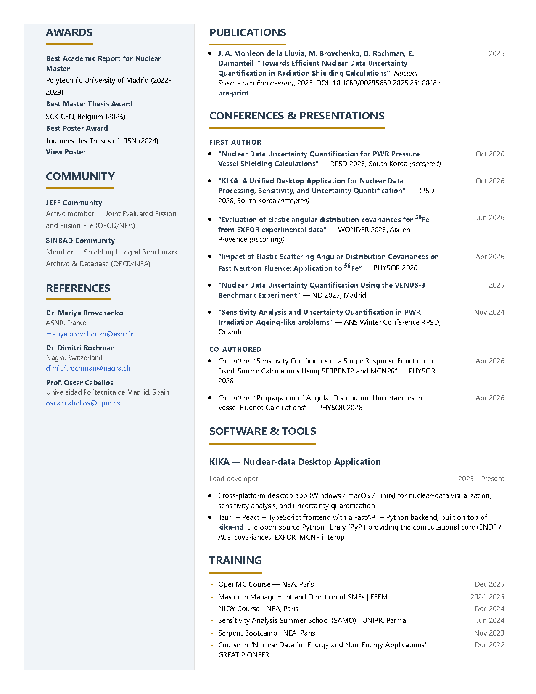

# Juan Antonio Monleón de la Lluvia

**Nuclear Engineer · PhD Student in Neutronics @ ASNR (formerly IRSN), France**

Working on uncertainty quantification and variance-reduction techniques for
reactor-vessel ageing. Hands-on with MCNP, Serpent, OpenMC, NJOY and ADVANTG;
active member of the JEFF and SINBAD nuclear-data communities.

📄 **[Download the résumé (PDF)](Resume.pdf)** &nbsp;·&nbsp;
🌐 **[View online](https://juanmonleon.github.io/Resume/)** &nbsp;·&nbsp;
💼 **[LinkedIn](https://linkedin.com/in/juanantonio-monleondelalluvia)** &nbsp;·&nbsp;
✉️ **[juanmonleon96@gmail.com](mailto:juanmonleon96@gmail.com)**

---

  

See page 2

  

---

## Publications & supporting documents

- **Journal paper (2025)** — [Towards Efficient Nuclear Data Uncertainty Quantification in Radiation Shielding Calculations](files/Monleon_2025_NSE_preprint.pdf) · *Nuclear Science and Engineering* · [DOI](https://www.tandfonline.com/doi/full/10.1080/00295639.2025.2510048)
- **Conference paper (2024)** — [Sensitivity Analysis and Uncertainty Quantification in PWR Irradiation Ageing-like problems](files/Monleon_2024_RPSD_conference.pdf) · ANS Winter Conference RPSD, Orlando
- **Award-winning poster (2024)** — [JdT 2024 Poster (IRSN)](files/Monleon_2024_JdT_poster.pdf)
- **Master's thesis (2023)** — [Reducing Spectrum-Driven Uncertainties with Variance Reduction Techniques](files/Monleon_2023_MasterThesis_SCK-CEN.pdf) · SCK CEN, Belgium
- **Master research (2023)** — [Enhancing the EXFOR nuclear data library with Machine Learning Techniques](files/Monleon_2023_MasterResearch_UPM.pdf)
- **KIKA app** — [kika-release](https://github.com/juanmonleon/kika-release) · cross-platform desktop app for nuclear-data visualization, sensitivity analysis, and uncertainty quantification (built on [kika-nd](https://github.com/juanmonleon/kika))
- **Degree certificates** — [MII](files/Monleon_Master_MII_UPM.pdf) · [MUCTN](files/Monleon_Master_MUCTN_UPM.pdf) · [GITI](files/Monleon_Bachelor_GITI_UPM.pdf)
